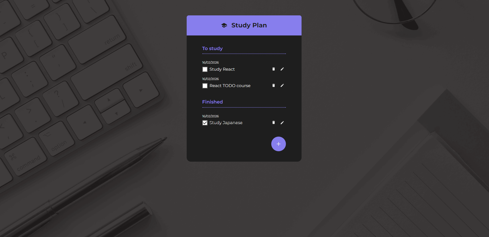

# Study Checklist App

A practical project developed step by step for those who already have a basic understanding of ReactJS and want to level up by building more organized, scalable applications with a modern user experience. Throughout the course, we create a checklist app to organize studies, tasks, and anything else you need.

## 🔨 Project Features

* Add, edit, and delete tasks  
* Organize tasks into "To Study" and "Completed"  
* Mark tasks as completed  
* Visual feedback for empty list (empty state)  
* Modal for adding/editing tasks  
* Animated task list  



## ✔️ Techniques and Technologies Used

The project development covers the following techniques and technologies:

* **useState and useEffect**: State management and persistence with localStorage  
* **useContext**: Global context to share task state  
* **Componentization**: Reusable components such as Button, FabButton, Dialog, TodoForm, TodoItem, and TodoGroup  
* **Styling with CSS Modules**: Organizing styles by component  
* **Controlled form handling**  
* **Local persistence with localStorage**: Saves tasks even after closing the app  
* **Custom SVG icons**  
* **Code organization best practices**  

## 🛠️ How to Run the Project

After downloading the project, follow the steps below to run it locally:

1. Make sure you already have Node.js installed ([official guide](https://nodejs.org/en/download/)).  
2. In the terminal, navigate to the project folder and install the dependencies:

```bash
npm install

3. Run the project:

```bash
npm run dev
```

4. Open in your browser: (http://localhost:5173) (Vite).
